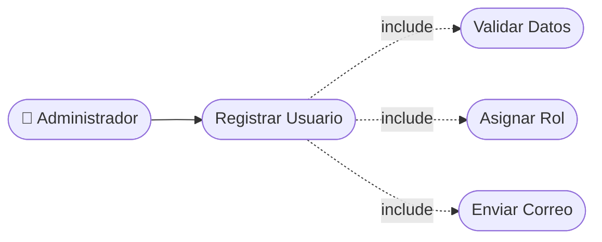

# CU-01 — Registro de Usuario

[⬅ Volver al README principal](../../../README.md)

---

## Identificación

| Campo | Valor |
|---|---|
| **ID** | CU-01 |
| **Historia de Usuario asociada** | [HU-001](../HUs/HU-001_registro_de_cuenta_cliente.md) |
| **Módulo** | Autenticacion y Acceso |
| **Actores** | Administrador |

---

## Descripción

Permite al administrador registrar nuevos usuarios en el sistema ingresando nombre, correo electrónico, contraseña y rol para controlar el acceso a la plataforma.

## Precondiciones

- El administrador debe haber iniciado sesión en el sistema.
- El rol del nuevo usuario debe estar definido previamente.

## Postcondiciones

- El nuevo usuario queda registrado en el sistema con su rol asignado.
- El sistema envía una notificación de bienvenida al usuario registrado.

## Secuencia Normal

| # | Acción (actor) | Reacción (sistema) |
|---|---|---|
| 1 | El administrador accede a la opción 'Registrar usuario'. | El sistema muestra el formulario de registro. |
| 2 | El administrador ingresa nombre, correo, contraseña y rol. | El sistema valida que todos los campos estén completos. |
| 3 | El administrador confirma el registro. | El sistema guarda el usuario y muestra mensaje de éxito. |

## Excepciones

| # | Acción (actor) | Reacción (sistema) |
|---|---|---|
| p | El administrador ingresa un correo ya registrado. | El sistema muestra: "El correo ya está en uso". |
| q | El administrador deja campos obligatorios vacíos. | El sistema indica los campos faltantes. |

## Rendimiento

El sistema debe registrar al usuario en menos de 3 segundos.

## Frecuencia de uso

Se realiza cuando se incorpora un nuevo integrante al equipo o llega un nuevo cliente.

## Diagrama de Caso de Uso

---

[⬅ Volver al README principal](../../../README.md)
