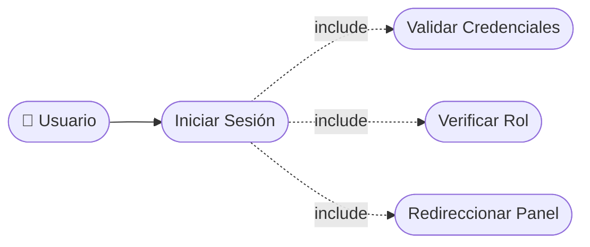

# CU-02 — Inicio de Sesión

[⬅ Volver al README principal](../../../README.md)

---

## Identificación

| Campo | Valor |
|---|---|
| **ID** | CU-02 |
| **Historia de Usuario asociada** | [HU-002](../HUs/HU-002_inicio_de_sesi%C3%B3n.md) |
| **Módulo** | Autenticacion y Acceso |
| **Actores** | Administrador, Barbero, Cliente |

---

## Descripción

Permite a los usuarios autenticarse ingresando su correo y contraseña para acceder a las funcionalidades del sistema según su rol.

## Precondiciones

- El usuario debe estar registrado en el sistema.
- El sistema debe estar en funcionamiento.

## Postcondiciones

- El usuario accede al panel correspondiente a su rol.
- El sistema registra la sesión activa.

## Secuencia Normal

| # | Acción (actor) | Reacción (sistema) |
|---|---|---|
| 1 | El usuario accede a la pantalla de inicio de sesión. | El sistema muestra el formulario de login. |
| 2 | El usuario ingresa su correo y contraseña. | El sistema valida las credenciales ingresadas. |
| 3 | El sistema verifica el rol del usuario. | El sistema redirige al panel correspondiente (admin, barbero o cliente). |

## Excepciones

| # | Acción (actor) | Reacción (sistema) |
|---|---|---|
| p | El usuario ingresa credenciales incorrectas. | El sistema muestra: "Correo o contraseña incorrectos". |
| q | El usuario deja algún campo vacío. | El sistema solicita completar los campos obligatorios. |
| r | El usuario no está registrado en el sistema. | El sistema muestra: "El usuario no existe en el sistema". |

## Rendimiento

El sistema debe autenticar al usuario en menos de 2 segundos.

## Frecuencia de uso

Se realiza múltiples veces al día por cada usuario activo del sistema.

## Diagrama de Caso de Uso

---

[⬅ Volver al README principal](../../../README.md)
