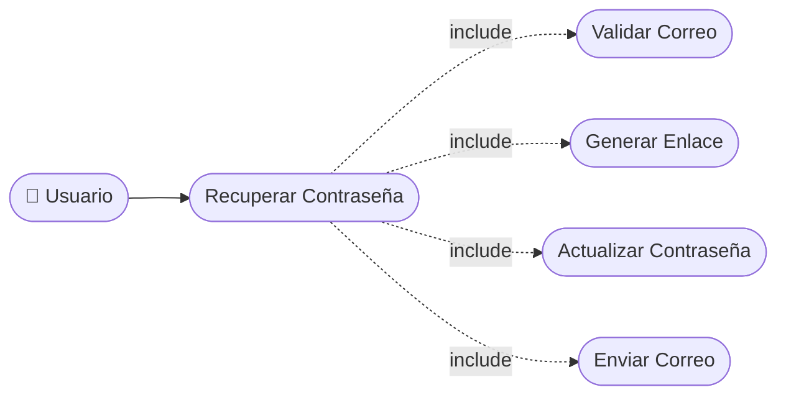

# CU-03 — Recuperación de Contraseña

[⬅ Volver al README principal](../../../README.md)

---

## Identificación

| Campo | Valor |
|---|---|
| **ID** | CU-03 |
| **Historia de Usuario asociada** | [HU-003](../HUs/HU-003_recuperaci%C3%B3n_de_contrase%C3%B1a.md) |
| **Módulo** | Autenticacion y Acceso |
| **Actores** | Administrador, Barbero, Cliente |

---

## Descripción

Permite a los usuarios recuperar el acceso a su cuenta ingresando su correo para recibir un enlace de restablecimiento de contraseña.

## Precondiciones

- El usuario debe estar registrado en el sistema.
- El usuario debe tener acceso a su correo electrónico.

## Postcondiciones

- El usuario recibe un enlace de restablecimiento de contraseña en su correo.
- La contraseña queda actualizada en el sistema.

## Secuencia Normal

| # | Acción (actor) | Reacción (sistema) |
|---|---|---|
| 1 | El usuario selecciona la opción 'Olvidé mi contraseña'. | El sistema muestra el formulario de recuperación. |
| 2 | El usuario ingresa su correo electrónico registrado. | El sistema verifica que el correo exista en la base de datos. |
| 3 | El sistema genera y envía el enlace de restablecimiento. | El usuario recibe el correo con el enlace. |
| 4 | El usuario ingresa su nueva contraseña y confirma. | El sistema actualiza la contraseña y confirma el cambio. |

## Excepciones

| # | Acción (actor) | Reacción (sistema) |
|---|---|---|
| p | El correo ingresado no está registrado en el sistema. | El sistema muestra: "El correo no está asociado a ninguna cuenta". |
| q | El enlace de restablecimiento ha expirado (más de 24 horas). | El sistema indica que el enlace venció y ofrece solicitar uno nuevo. |

## Rendimiento

El correo de recuperación debe enviarse en menos de 30 segundos.

## Frecuencia de uso

Se realiza ocasionalmente cuando un usuario olvida sus credenciales de acceso.

## Diagrama de Caso de Uso

---

[⬅ Volver al README principal](../../../README.md)
