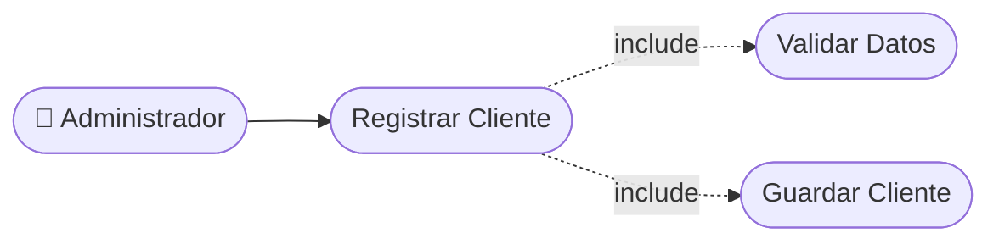

# CU-04 — Registro de Clientes

[⬅ Volver al README principal](../../../README.md)

---

## Identificación

| Campo | Valor |
|---|---|
| **ID** | CU-04 |
| **Historia de Usuario asociada** | [HU-004](../HUs/HU-004_registro_de_clientes_por_personal.md) |
| **Módulo** | Gestion de Clientes, Servicios y Barberos |
| **Actores** | Administrador |

---

## Descripción

Permite al administrador registrar nuevos clientes en el sistema ingresando nombre, teléfono y correo electrónico para facilitar la gestión de citas.

## Precondiciones

- El administrador debe haber iniciado sesión.
- El cliente no debe estar registrado previamente en el sistema.

## Postcondiciones

- El cliente queda registrado en el sistema.
- El cliente aparece disponible en la lista para asignarle citas.

## Secuencia Normal

| # | Acción (actor) | Reacción (sistema) |
|---|---|---|
| 1 | El administrador accede al módulo de clientes. | El sistema muestra la lista de clientes registrados. |
| 2 | El administrador selecciona 'Nuevo cliente'. | El sistema muestra el formulario de registro. |
| 3 | El administrador ingresa nombre, teléfono y correo. | El sistema valida los datos ingresados. |
| 4 | El administrador confirma el registro. | El sistema guarda el cliente y muestra confirmación. |

## Excepciones

| # | Acción (actor) | Reacción (sistema) |
|---|---|---|
| p | El correo o teléfono ya está registrado. | El sistema muestra: "El cliente ya existe en el sistema". |
| q | Faltan datos obligatorios. | El sistema indica los campos pendientes. |

## Rendimiento

El registro debe completarse en menos de 3 segundos.

## Frecuencia de uso

Se realiza cada vez que llega un cliente nuevo a la barbería.

## Diagrama de Caso de Uso

---

[⬅ Volver al README principal](../../../README.md)
