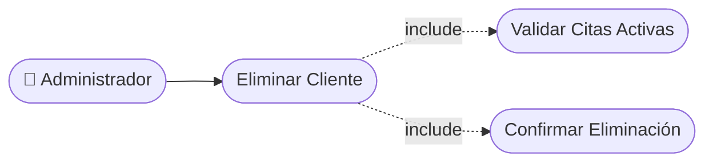

# CU-06 — Eliminación de Cliente

[⬅ Volver al README principal](../../../README.md)

---

## Identificación

| Campo | Valor |
|---|---|
| **ID** | CU-06 |
| **Historia de Usuario asociada** | [HU-006](../HUs/HU-006_desactivaci%C3%B3n_de_clientes.md) |
| **Módulo** | Gestion de Clientes, Servicios y Barberos |
| **Actores** | Administrador |

---

## Descripción

Permite al administrador eliminar el registro de un cliente del sistema cuando ya no sea necesario mantener su información.

## Precondiciones

- El administrador debe haber iniciado sesión.
- El cliente debe estar registrado en el sistema.

## Postcondiciones

- El registro del cliente queda eliminado del sistema.
- La lista de clientes se actualiza sin el cliente eliminado.

## Secuencia Normal

| # | Acción (actor) | Reacción (sistema) |
|---|---|---|
| 1 | El administrador busca y selecciona el cliente a eliminar. | El sistema muestra el perfil del cliente con la opción de eliminar. |
| 2 | El administrador selecciona la opción 'Eliminar cliente'. | El sistema solicita confirmación antes de proceder. |
| 3 | El administrador confirma la eliminación. | El sistema elimina el registro y actualiza la lista de clientes. |

## Excepciones

| # | Acción (actor) | Reacción (sistema) |
|---|---|---|
| p | El cliente tiene citas activas en el sistema. | El sistema muestra una advertencia y no permite la eliminación. |
| q | El administrador cancela la acción. | El sistema mantiene el registro sin cambios. |

## Rendimiento

La eliminación debe completarse en menos de 2 segundos.

## Frecuencia de uso

Se realiza ocasionalmente para mantener limpia la base de datos de clientes.

## Diagrama de Caso de Uso

---

[⬅ Volver al README principal](../../../README.md)
