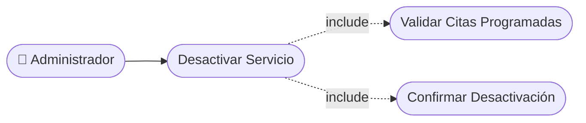

# CU-08 — Desactivación de Servicio

[⬅ Volver al README principal](../../../README.md)

---

## Identificación

| Campo | Valor |
|---|---|
| **ID** | CU-08 |
| **Historia de Usuario asociada** | [HU-008](../HUs/HU-008_desactivaci%C3%B3n_temporal_de_servicios.md) |
| **Módulo** | Gestion de Clientes, Servicios y Barberos |
| **Actores** | Administrador |

---

## Descripción

Permite al administrador desactivar temporalmente un servicio del catálogo para que no esté disponible para nuevas reservas sin eliminarlo.

## Precondiciones

- El administrador debe haber iniciado sesión.
- El servicio debe estar activo en el sistema.

## Postcondiciones

- El servicio queda desactivado y oculto en el catálogo de reservas.
- El historial del servicio se conserva en el sistema.

## Secuencia Normal

| # | Acción (actor) | Reacción (sistema) |
|---|---|---|
| 1 | El administrador accede al módulo de servicios. | El sistema muestra la lista de servicios activos. |
| 2 | El administrador selecciona un servicio y elige 'Desactivar'. | El sistema solicita confirmación de la desactivación. |
| 3 | El administrador confirma la desactivación. | El sistema marca el servicio como inactivo y lo oculta del catálogo. |

## Excepciones

| # | Acción (actor) | Reacción (sistema) |
|---|---|---|
| p | El servicio tiene citas futuras agendadas. | El sistema muestra una advertencia con las citas que serían afectadas. |
| q | El administrador cancela la acción. | El sistema mantiene el servicio activo sin cambios. |

## Rendimiento

La desactivación debe aplicarse en menos de 2 segundos.

## Frecuencia de uso

Se realiza cuando un servicio está fuera de temporada o no está disponible temporalmente.

## Diagrama de Caso de Uso

---

[⬅ Volver al README principal](../../../README.md)
