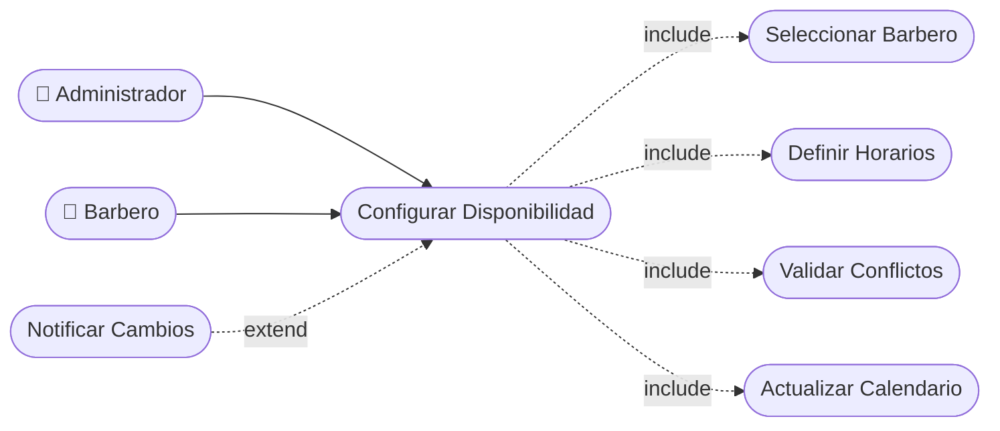

# CU-10 — Configuración de Disponibilidad de Barberos

[⬅ Volver al README principal](../../../README.md)

---

## Identificación

| Campo | Valor |
|---|---|
| **ID** | CU-10 |
| **Historia de Usuario asociada** | [HU-010](../HUs/HU-010_asignaci%C3%B3n_de_horarios_de_trabajo.md) |
| **Módulo** | Disponibilidad y Agendamiento de Citas |
| **Actores** | Administrador, Barbero |

---

## Descripción

Permite al administrador asignar un horario de trabajo a cada barbero indicando días y franjas horarias disponibles para agendar citas.

## Precondiciones

- El barbero debe estar registrado en el sistema.
- El administrador debe haber iniciado sesión.

## Postcondiciones

- La disponibilidad del barbero queda configurada en el sistema.
- El calendario del barbero bloquea horarios fuera del turno definido.

## Secuencia Normal

| # | Acción (actor) | Reacción (sistema) |
|---|---|---|
| 1 | El administrador selecciona un barbero del directorio. | El sistema muestra el perfil del barbero. |
| 2 | El administrador accede a la configuración de horarios. | El sistema muestra el calendario de disponibilidad del barbero. |
| 3 | El administrador define los días y franjas horarias de trabajo. | El sistema valida que no haya conflictos con citas existentes. |
| 4 | El administrador guarda la configuración. | El sistema aplica la disponibilidad y confirma el cambio. |

## Excepciones

| # | Acción (actor) | Reacción (sistema) |
|---|---|---|
| p | El barbero tiene citas en el horario que se intenta bloquear. | El sistema muestra una advertencia y solicita confirmación. |
| q | No se selecciona ninguna franja horaria. | El sistema indica que debe configurarse al menos una franja horaria. |

## Rendimiento

Los cambios de disponibilidad deben aplicarse en menos de 2 segundos.

## Frecuencia de uso

Se realiza al contratar un barbero o cuando cambia su turno de trabajo.

## Diagrama de Caso de Uso

---

[⬅ Volver al README principal](../../../README.md)
