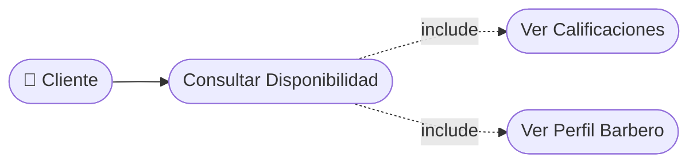

# CU-11 — Consulta de Perfil de Barbero

[⬅ Volver al README principal](../../../README.md)

---

## Identificación

| Campo | Valor |
|---|---|
| **ID** | CU-11 |
| **Historia de Usuario asociada** | [HU-011](../HUs/HU-011_visualizaci%C3%B3n_de_perfil_de_barbero.md) |
| **Módulo** | Disponibilidad y Agendamiento de Citas |
| **Actores** | Cliente |

---

## Descripción

Permite al cliente ver el perfil de cada barbero con nombre, especialidad y calificación promedio antes de seleccionarlo para una cita.

## Precondiciones

- El cliente debe haber iniciado sesión en la plataforma.
- Deben existir barberos registrados y activos en el sistema.

## Postcondiciones

- El cliente visualiza el perfil completo del barbero seleccionado.
- El sistema muestra la disponibilidad del barbero para agendar.

## Secuencia Normal

| # | Acción (actor) | Reacción (sistema) |
|---|---|---|
| 1 | El cliente accede a la sección de reservas. | El sistema muestra la lista de barberos disponibles con perfil y calificación. |
| 2 | El cliente selecciona un barbero para ver su perfil. | El sistema muestra nombre, especialidad, calificación promedio y comentarios. |
| 3 | El cliente decide agendar con ese barbero. | El sistema muestra los horarios disponibles del barbero seleccionado. |

## Excepciones

| # | Acción (actor) | Reacción (sistema) |
|---|---|---|
| p | El barbero seleccionado no tiene calificaciones registradas. | El sistema muestra: "Sin calificaciones aún" en el perfil del barbero. |
| q | El barbero no tiene horarios disponibles próximamente. | El sistema indica que el barbero no tiene disponibilidad y sugiere elegir otro. |

## Rendimiento

El perfil del barbero debe cargarse en menos de 2 segundos.

## Frecuencia de uso

Se consulta cada vez que un cliente desea conocer al profesional antes de agendar.

## Diagrama de Caso de Uso

---

[⬅ Volver al README principal](../../../README.md)
