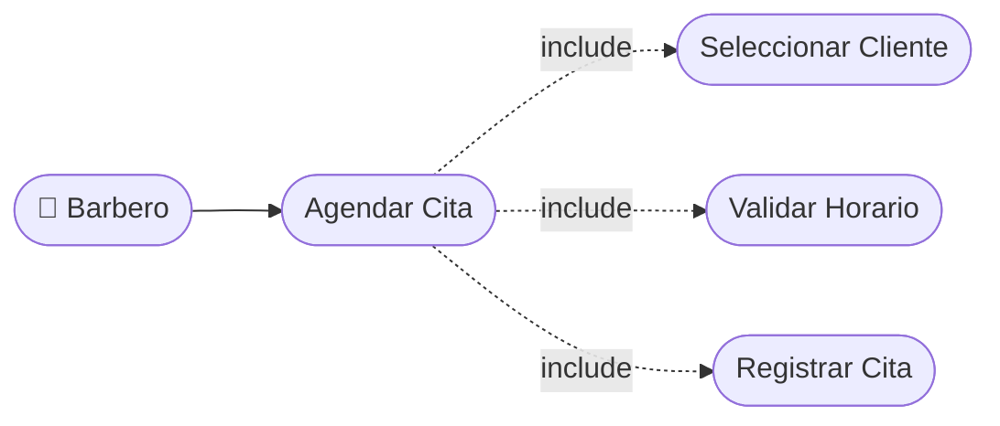

# CU-12 — Agendamiento de Citas (Barbero)

[⬅ Volver al README principal](../../../README.md)

---

## Identificación

| Campo | Valor |
|---|---|
| **ID** | CU-12 |
| **Historia de Usuario asociada** | [HU-012](../HUs/HU-012_agendamiento_manual_por_administrador.md) |
| **Módulo** | Disponibilidad y Agendamiento de Citas |
| **Actores** | Barbero |

---

## Descripción

Permite al barbero registrar manualmente una cita seleccionando cliente, servicio, fecha y hora para organizar los horarios de atención del día.

## Precondiciones

- El barbero debe haber iniciado sesión.
- Deben existir clientes y servicios registrados.
- Deben existir horarios disponibles.

## Postcondiciones

- La cita queda registrada en el sistema.
- La agenda del barbero se actualiza con la nueva cita.

## Secuencia Normal

| # | Acción (actor) | Reacción (sistema) |
|---|---|---|
| 1 | El barbero accede a la opción 'Agendar cita'. | El sistema muestra el formulario de registro de cita. |
| 2 | El barbero selecciona el cliente y el servicio. | El sistema muestra la duración estimada del servicio. |
| 3 | El barbero selecciona la fecha y la hora. | El sistema valida la disponibilidad del horario. |
| 4 | El barbero confirma el registro. | El sistema guarda la cita y la muestra en la agenda. |

## Excepciones

| # | Acción (actor) | Reacción (sistema) |
|---|---|---|
| p | El horario seleccionado ya está ocupado. | El sistema muestra: "El horario seleccionado no está disponible". |
| q | Faltan campos obligatorios. | El sistema muestra: "Complete la información obligatoria". |
| r | El cliente no existe en el sistema. | El sistema muestra: "El cliente no está registrado en el sistema". |

## Rendimiento

El sistema debe registrar la cita en menos de 3 segundos.

## Frecuencia de uso

Se realiza varias veces al día dependiendo de la cantidad de clientes.

## Diagrama de Caso de Uso

---

[⬅ Volver al README principal](../../../README.md)
