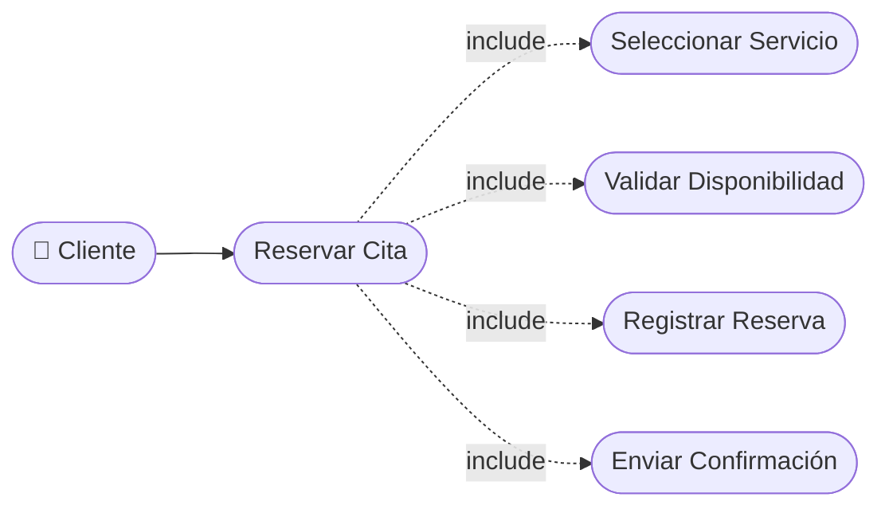

# CU-13 — Reserva de Cita en Línea (Cliente)

[⬅ Volver al README principal](../../../README.md)

---

## Identificación

| Campo | Valor |
|---|---|
| **ID** | CU-13 |
| **Historia de Usuario asociada** | [HU-013](../HUs/HU-013_reserva_de_cita_en_l%C3%ADnea_por_cliente.md) |
| **Módulo** | Disponibilidad y Agendamiento de Citas |
| **Actores** | Cliente |

---

## Descripción

Permite al cliente reservar una cita desde la plataforma web seleccionando servicio, barbero, fecha y hora disponibles de forma autónoma.

## Precondiciones

- El cliente debe haber iniciado sesión en la plataforma.
- Deben existir servicios y barberos disponibles con horarios libres.

## Postcondiciones

- La cita queda registrada y aparece en la agenda del barbero asignado.
- El cliente recibe confirmación de la reserva por correo electrónico.

## Secuencia Normal

| # | Acción (actor) | Reacción (sistema) |
|---|---|---|
| 1 | El cliente accede a la sección de reservas. | El sistema muestra el catálogo de servicios disponibles. |
| 2 | El cliente selecciona el servicio y el barbero deseado. | El sistema muestra el calendario con horarios disponibles del barbero. |
| 3 | El cliente selecciona fecha y hora. | El sistema valida la disponibilidad del horario elegido. |
| 4 | El cliente confirma la reserva. | El sistema registra la cita y envía confirmación por correo. |

## Excepciones

| # | Acción (actor) | Reacción (sistema) |
|---|---|---|
| p | El horario seleccionado ya fue tomado por otro cliente. | El sistema notifica y solicita seleccionar otro horario disponible. |
| q | El cliente no ha completado su perfil. | El sistema solicita completar los datos requeridos antes de continuar. |

## Rendimiento

El sistema debe confirmar la reserva en menos de 3 segundos.

## Frecuencia de uso

Se realiza varias veces al día por los clientes registrados en la plataforma.

## Diagrama de Caso de Uso

---

[⬅ Volver al README principal](../../../README.md)
