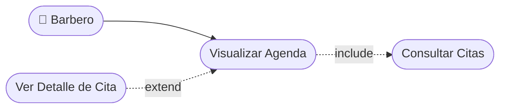

# CU-14 — Visualización de Agenda del Barbero

[⬅ Volver al README principal](../../../README.md)

---

## Identificación

| Campo | Valor |
|---|---|
| **ID** | CU-14 |
| **Historia de Usuario asociada** | [HU-014](../HUs/HU-014_visualizaci%C3%B3n_de_agenda_del_barbero.md) |
| **Módulo** | Disponibilidad y Agendamiento de Citas |
| **Actores** | Barbero |

---

## Descripción

Permite al barbero visualizar todas las citas programadas en su agenda organizadas por fecha y hora para planificar su jornada laboral.

## Precondiciones

- El barbero debe haber iniciado sesión.
- Deben existir citas registradas para la fecha consultada.

## Postcondiciones

- El barbero visualiza sus citas del día ordenadas por hora.
- El barbero puede ver el detalle de cada cita desde la agenda.

## Secuencia Normal

| # | Acción (actor) | Reacción (sistema) |
|---|---|---|
| 1 | El barbero accede al módulo de agenda. | El sistema muestra las citas del día actual organizadas por hora. |
| 2 | El barbero navega entre fechas para consultar otros días. | El sistema actualiza la vista con las citas de la fecha seleccionada. |
| 3 | El barbero selecciona una cita para ver su detalle. | El sistema muestra cliente, servicio, hora y estado de la cita. |

## Excepciones

| # | Acción (actor) | Reacción (sistema) |
|---|---|---|
| p | No hay citas registradas para la fecha seleccionada. | El sistema muestra: "No hay citas programadas para esta fecha". |

## Rendimiento

La agenda debe cargarse en menos de 2 segundos.

## Frecuencia de uso

Se consulta varias veces al día por el barbero para organizar su jornada.

## Diagrama de Caso de Uso

---

[⬅ Volver al README principal](../../../README.md)
