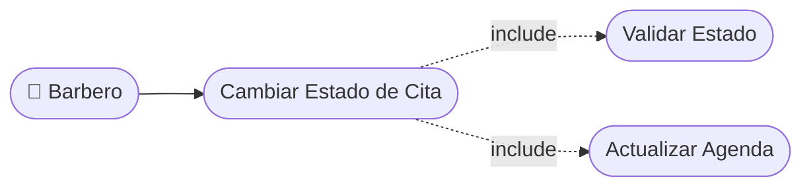

# CU-15 — Cambio de Estado de Cita

[⬅ Volver al README principal](../../../README.md)

---

## Identificación

| Campo | Valor |
|---|---|
| **ID** | CU-15 |
| **Historia de Usuario asociada** | [HU-015](../HUs/HU-015_cambio_de_estado_de_cita.md) |
| **Módulo** | Disponibilidad y Agendamiento de Citas |
| **Actores** | Barbero |

---

## Descripción

Permite al barbero actualizar el estado de una cita a pendiente, en atención o completada según el desarrollo del servicio en tiempo real.

## Precondiciones

- La cita debe estar registrada en el sistema.
- El barbero debe haber iniciado sesión.

## Postcondiciones

- El estado de la cita queda actualizado en la agenda.
- Si la cita se marca como completada, el sistema registra la fecha y hora de finalización.

## Secuencia Normal

| # | Acción (actor) | Reacción (sistema) |
|---|---|---|
| 1 | El barbero accede a la cita en su agenda. | El sistema muestra los detalles de la cita con las opciones de estado. |
| 2 | El barbero selecciona el nuevo estado de la cita. | El sistema solicita confirmación del cambio de estado. |
| 3 | El barbero confirma el cambio. | El sistema actualiza la cita y refleja el nuevo estado en la agenda. |

## Excepciones

| # | Acción (actor) | Reacción (sistema) |
|---|---|---|
| p | El barbero intenta marcar como completada una cita cancelada. | El sistema no permite el cambio y muestra una advertencia. |
| q | El barbero intenta cambiar el estado de una cita de otro barbero. | El sistema niega el acceso y muestra un mensaje de permiso insuficiente. |

## Rendimiento

El cambio de estado debe procesarse en menos de 2 segundos.

## Frecuencia de uso

Se realiza varias veces al día a medida que los clientes son atendidos.

## Diagrama de Caso de Uso

---

[⬅ Volver al README principal](../../../README.md)
