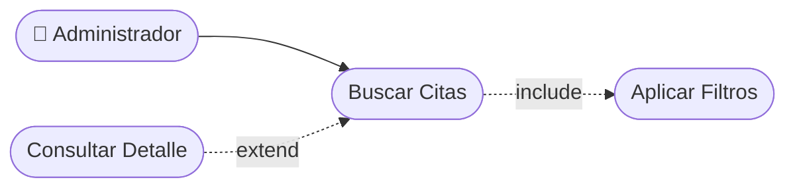

# CU-16 — Búsqueda y Filtrado de Citas

[⬅ Volver al README principal](../../../README.md)

---

## Identificación

| Campo | Valor |
|---|---|
| **ID** | CU-16 |
| **Historia de Usuario asociada** | [HU-016](../HUs/HU-016_b%C3%BAsqueda_y_filtrado_de_citas.md) |
| **Módulo** | Disponibilidad y Agendamiento de Citas |
| **Actores** | Administrador |

---

## Descripción

Permite al administrador buscar y filtrar citas por fecha, barbero, cliente o estado para localizar información específica de forma eficiente.

## Precondiciones

- El administrador debe haber iniciado sesión.
- Deben existir citas registradas en el sistema.

## Postcondiciones

- El sistema muestra solo las citas que coinciden con los filtros aplicados.
- Los resultados se presentan ordenados de forma clara.

## Secuencia Normal

| # | Acción (actor) | Reacción (sistema) |
|---|---|---|
| 1 | El administrador accede al módulo de citas. | El sistema muestra todas las citas con opciones de filtro disponibles. |
| 2 | El administrador aplica uno o más filtros (fecha, barbero, estado). | El sistema actualiza los resultados en tiempo real. |
| 3 | El administrador selecciona una cita para ver su detalle. | El sistema muestra la información completa de la cita seleccionada. |

## Excepciones

| # | Acción (actor) | Reacción (sistema) |
|---|---|---|
| p | Ninguna cita coincide con los filtros aplicados. | El sistema muestra: "No se encontraron citas con esos criterios". |
| q | El administrador elimina los filtros. | El sistema muestra nuevamente todas las citas registradas. |

## Rendimiento

Los resultados de búsqueda deben mostrarse en menos de 2 segundos.

## Frecuencia de uso

Se realiza frecuentemente para localizar citas específicas en el sistema.

## Diagrama de Caso de Uso

---

[⬅ Volver al README principal](../../../README.md)
