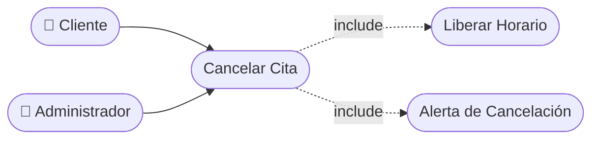

# CU-17 — Cancelación de Cita por el Cliente

[⬅ Volver al README principal](../../../README.md)

---

## Identificación

| Campo | Valor |
|---|---|
| **ID** | CU-17 |
| **Historia de Usuario asociada** | [HU-017](../HUs/HU-017_cancelaci%C3%B3n_de_cita_por_cliente.md) |
| **Módulo** | Disponibilidad y Agendamiento de Citas |
| **Actores** | Cliente |

---

## Descripción

Permite al cliente cancelar una cita previamente agendada desde su perfil en la plataforma, liberando el horario en la agenda del barbero.

## Precondiciones

- El cliente debe haber iniciado sesión.
- La cita debe estar registrada y en estado activo.

## Postcondiciones

- La cita queda marcada como cancelada.
- El horario queda disponible nuevamente en la agenda.
- El barbero asignado recibe notificación de la cancelación.

## Secuencia Normal

| # | Acción (actor) | Reacción (sistema) |
|---|---|---|
| 1 | El cliente accede a sus citas activas desde su perfil. | El sistema muestra la lista de citas activas del cliente. |
| 2 | El cliente selecciona la cita a cancelar. | El sistema solicita confirmación antes de proceder. |
| 3 | El cliente confirma la cancelación. | El sistema actualiza el estado a 'Cancelada' y libera el horario. |

## Excepciones

| # | Acción (actor) | Reacción (sistema) |
|---|---|---|
| p | La cancelación se realiza con menos de 2 horas de anticipación. | El sistema muestra una advertencia al cliente sobre la cancelación tardía. |
| q | La cita ya fue cancelada previamente. | El sistema informa que la cita ya se encuentra cancelada. |

## Rendimiento

La cancelación debe procesarse en menos de 2 segundos.

## Frecuencia de uso

Se realiza ocasionalmente cuando el cliente tiene imprevistos.

## Diagrama de Caso de Uso

---

[⬅ Volver al README principal](../../../README.md)
