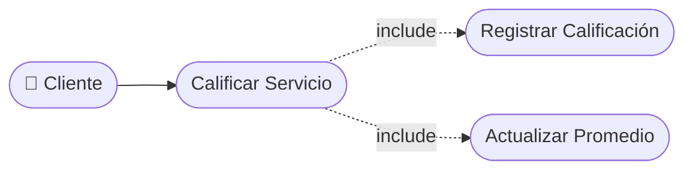

# CU-18 — Calificación del Servicio

[⬅ Volver al README principal](../../../README.md)

---

## Identificación

| Campo | Valor |
|---|---|
| **ID** | CU-18 |
| **Historia de Usuario asociada** | [HU-018](../HUs/HU-018_calificaci%C3%B3n_del_servicio_recibido.md) |
| **Módulo** | Calificaciones, Historial y Notificaciones |
| **Actores** | Cliente |

---

## Descripción

Permite al cliente calificar el servicio recibido después de que su cita haya sido marcada como completada, con una puntuación y comentario opcional.

## Precondiciones

- La cita debe estar marcada como completada.
- El cliente debe haber iniciado sesión en la plataforma.

## Postcondiciones

- La calificación queda registrada en el sistema.
- La calificación promedio del barbero se actualiza con el nuevo valor.

## Secuencia Normal

| # | Acción (actor) | Reacción (sistema) |
|---|---|---|
| 1 | El cliente accede a su historial de citas completadas. | El sistema muestra las citas completadas con opción de calificar. |
| 2 | El cliente selecciona una cita y asigna una puntuación (1 a 5 estrellas). | El sistema habilita el campo de comentario opcional. |
| 3 | El cliente envía la calificación. | El sistema registra la calificación y actualiza el perfil del barbero. |

## Excepciones

| # | Acción (actor) | Reacción (sistema) |
|---|---|---|
| p | El cliente intenta calificar una cita que ya fue evaluada. | El sistema muestra: "Ya has calificado este servicio". |
| q | El cliente no selecciona ninguna puntuación. | El sistema solicita seleccionar al menos una estrella antes de enviar. |

## Rendimiento

La calificación debe registrarse en menos de 2 segundos.

## Frecuencia de uso

Se realiza después de cada cita completada cuando el cliente desea dar su opinión.

## Diagrama de Caso de Uso

---

[⬅ Volver al README principal](../../../README.md)
