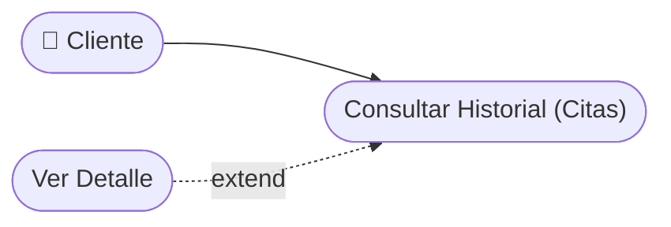

# CU-19 — Consulta de Historial de Citas del Cliente

[⬅ Volver al README principal](../../../README.md)

---

## Identificación

| Campo | Valor |
|---|---|
| **ID** | CU-19 |
| **Historia de Usuario asociada** | [HU-019](../HUs/HU-019_historial_de_citas_del_cliente.md) |
| **Módulo** | Calificaciones, Historial y Notificaciones |
| **Actores** | Cliente |

---

## Descripción

Permite al cliente ver el historial completo de sus citas pasadas con el detalle de cada servicio recibido, fecha, barbero y costo.

## Precondiciones

- El cliente debe haber iniciado sesión.
- Deben existir citas registradas a nombre del cliente.

## Postcondiciones

- El cliente visualiza su historial completo de servicios.
- El cliente puede consultar el detalle de cada cita anterior.

## Secuencia Normal

| # | Acción (actor) | Reacción (sistema) |
|---|---|---|
| 1 | El cliente accede a su perfil en la plataforma. | El sistema muestra las opciones disponibles del perfil. |
| 2 | El cliente selecciona 'Historial de citas'. | El sistema muestra la lista de citas pasadas ordenadas por fecha. |
| 3 | El cliente selecciona una cita para ver su detalle. | El sistema muestra fecha, servicio, barbero, estado y costo de la cita. |

## Excepciones

| # | Acción (actor) | Reacción (sistema) |
|---|---|---|
| p | El cliente no tiene citas anteriores registradas. | El sistema muestra: "Aún no tienes citas registradas". |

## Rendimiento

El historial debe cargarse en menos de 2 segundos.

## Frecuencia de uso

Se consulta ocasionalmente por los clientes para revisar sus visitas anteriores.

## Diagrama de Caso de Uso

---

[⬅ Volver al README principal](../../../README.md)
