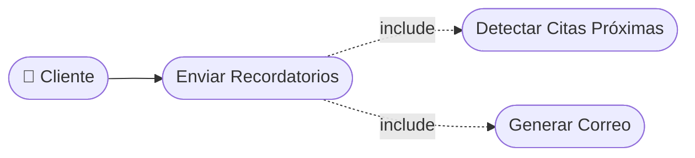

# CU-20 — Envío de Recordatorios Automáticos

[⬅ Volver al README principal](../../../README.md)

---

## Identificación

| Campo | Valor |
|---|---|
| **ID** | CU-20 |
| **Historia de Usuario asociada** | [HU-020](../HUs/HU-020_recordatorio_autom%C3%A1tico_de_cita.md) |
| **Módulo** | Calificaciones, Historial y Notificaciones |
| **Actores** | Sistema (proceso automático), Cliente |

---

## Descripción

El sistema envía automáticamente recordatorios por correo electrónico a los clientes 24 horas antes de su cita programada para reducir ausencias.

## Precondiciones

- Deben existir citas confirmadas en el sistema.
- El cliente debe tener un correo electrónico válido registrado.

## Postcondiciones

- El cliente recibe el recordatorio con los detalles de su cita.
- El sistema registra el envío del recordatorio como exitoso.

## Secuencia Normal

| # | Acción (actor) | Reacción (sistema) |
|---|---|---|
| 1 | El sistema detecta citas programadas para las próximas 24 horas. | El sistema genera los recordatorios correspondientes. |
| 2 | El sistema envía los correos de recordatorio. | El cliente recibe la notificación con fecha, hora, servicio y barbero. |
| 3 | El sistema registra el envío como exitoso. | El sistema actualiza el estado del recordatorio a 'Enviado'. |

## Excepciones

| # | Acción (actor) | Reacción (sistema) |
|---|---|---|
| p | El correo del cliente es inválido o inexistente. | El sistema registra el fallo y notifica al administrador. |
| q | La cita es cancelada antes de enviarse el recordatorio. | El sistema cancela el recordatorio programado automáticamente. |

## Rendimiento

Los recordatorios deben enviarse con precisión máxima de 5 minutos respecto al tiempo programado.

## Frecuencia de uso

Se ejecuta automáticamente de forma continua en segundo plano del sistema.

## Diagrama de Caso de Uso

---

[⬅ Volver al README principal](../../../README.md)
