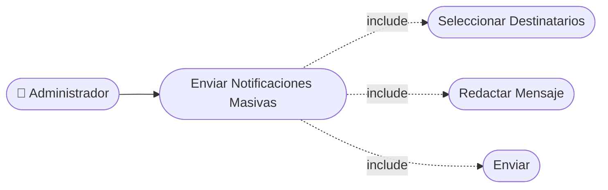

# CU-22 — Envío de Notificaciones Masivas

[⬅ Volver al README principal](../../../README.md)

---

## Identificación

| Campo | Valor |
|---|---|
| **ID** | CU-22 |
| **Historia de Usuario asociada** | [HU-022](../HUs/HU-022_env%C3%ADo_de_notificaciones_masivas.md) |
| **Módulo** | Calificaciones, Historial y Notificaciones |
| **Actores** | Administrador |

---

## Descripción

Permite al administrador enviar mensajes masivos a los clientes sobre promociones, cambios de horario o comunicados del negocio.

## Precondiciones

- El administrador debe haber iniciado sesión.
- Deben existir clientes registrados con correo electrónico válido.

## Postcondiciones

- El mensaje es enviado a todos los destinatarios seleccionados.
- El sistema muestra un resumen de la cantidad de mensajes enviados.

## Secuencia Normal

| # | Acción (actor) | Reacción (sistema) |
|---|---|---|
| 1 | El administrador accede al módulo de notificaciones. | El sistema muestra la lista de clientes y el formulario de mensaje. |
| 2 | El administrador redacta el mensaje y selecciona los destinatarios. | El sistema valida que el mensaje no esté vacío y haya al menos un destinatario. |
| 3 | El administrador confirma el envío. | El sistema envía los correos y muestra el resumen de envíos exitosos. |

## Excepciones

| # | Acción (actor) | Reacción (sistema) |
|---|---|---|
| p | No se selecciona ningún destinatario. | El sistema muestra: "Debe seleccionar al menos un destinatario". |
| q | El mensaje está vacío. | El sistema solicita ingresar el contenido del mensaje antes de enviar. |

## Rendimiento

El envío debe completarse en menos de 10 segundos para lotes de hasta 50 destinatarios.

## Frecuencia de uso

Se realiza ocasionalmente para comunicaciones especiales o promocionales.

## Diagrama de Caso de Uso

---

[⬅ Volver al README principal](../../../README.md)
