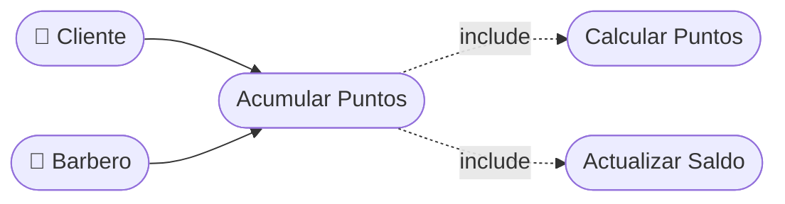

# CU-23 — Acumulación de Puntos por Cita

[⬅ Volver al README principal](../../../README.md)

---

## Identificación

| Campo | Valor |
|---|---|
| **ID** | CU-23 |
| **Historia de Usuario asociada** | [HU-023](../HUs/HU-023_acumulaci%C3%B3n_autom%C3%A1tica_de_puntos.md) |
| **Módulo** | Programa de Fidelizacion (Puntos) |
| **Actores** | Sistema, Barbero, Cliente |

---

## Descripción

El sistema asigna automáticamente puntos de fidelización al cliente cada vez que una cita es marcada como completada según el servicio realizado.

## Precondiciones

- La cita debe estar marcada como completada.
- El servicio debe tener asignado un valor en puntos.

## Postcondiciones

- Los puntos son acreditados al saldo del cliente.
- El cliente puede ver los puntos actualizados en su perfil.

## Secuencia Normal

| # | Acción (actor) | Reacción (sistema) |
|---|---|---|
| 1 | El barbero marca una cita como completada. | El sistema detecta que corresponde acreditar puntos al cliente. |
| 2 | El sistema calcula los puntos según el servicio realizado. | El sistema acredita los puntos al saldo del cliente. |
| 3 | El sistema actualiza el historial de puntos. | El cliente puede ver los nuevos puntos reflejados en su perfil. |

## Excepciones

| # | Acción (actor) | Reacción (sistema) |
|---|---|---|
| p | El servicio no tiene asignado valor en puntos. | El sistema no acredita puntos y registra el evento sin puntuación. |

## Rendimiento

Los puntos deben acreditarse en menos de 2 segundos tras completar la cita.

## Frecuencia de uso

Se ejecuta automáticamente cada vez que se completa una cita en el sistema.

## Diagrama de Caso de Uso

---

[⬅ Volver al README principal](../../../README.md)
