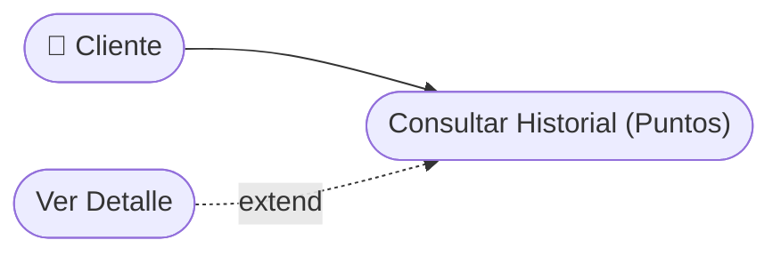

# CU-24 — Consulta de Saldo y Movimientos de Puntos

[⬅ Volver al README principal](../../../README.md)

---

## Identificación

| Campo | Valor |
|---|---|
| **ID** | CU-24 |
| **Historia de Usuario asociada** | [HU-024](../HUs/HU-024_consulta_de_saldo_de_puntos.md) |
| **Módulo** | Programa de Fidelizacion (Puntos) |
| **Actores** | Cliente |

---

## Descripción

Permite al cliente consultar su saldo actual de puntos acumulados y el historial detallado de ganancias y canjes desde su perfil.

## Precondiciones

- El cliente debe haber iniciado sesión.
- El cliente debe tener al menos un movimiento de puntos registrado.

## Postcondiciones

- El cliente visualiza su saldo actual y el historial completo de movimientos.
- La información se muestra actualizada en tiempo real.

## Secuencia Normal

| # | Acción (actor) | Reacción (sistema) |
|---|---|---|
| 1 | El cliente accede a su perfil en la plataforma. | El sistema muestra el saldo actual de puntos de forma destacada. |
| 2 | El cliente selecciona 'Ver historial de puntos'. | El sistema muestra los movimientos con fecha, concepto y cantidad de puntos. |

## Excepciones

| # | Acción (actor) | Reacción (sistema) |
|---|---|---|
| p | El cliente no tiene movimientos de puntos registrados. | El sistema muestra: "Aún no tienes puntos acumulados". |

## Rendimiento

El historial de puntos debe cargarse en menos de 2 segundos.

## Frecuencia de uso

Se consulta ocasionalmente por los clientes para revisar sus beneficios acumulados.

## Diagrama de Caso de Uso

---

[⬅ Volver al README principal](../../../README.md)
