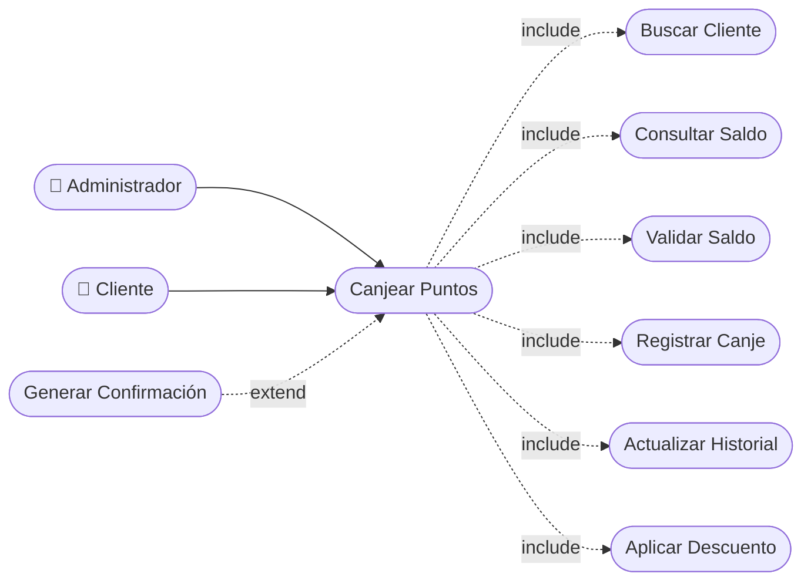

# CU-26 — Canje de Puntos

[⬅ Volver al README principal](../../../README.md)

---

## Identificación

| Campo | Valor |
|---|---|
| **ID** | CU-26 |
| **Historia de Usuario asociada** | [HU-026](../HUs/HU-026_canje_de_puntos_por_descuentos.md) |
| **Módulo** | Programa de Fidelizacion (Puntos) |
| **Actores** | Administrador, Cliente |

---

## Descripción

Permite al administrador registrar el canje de puntos acumulados de un cliente como descuento aplicado al pago de un servicio.

## Precondiciones

- El cliente debe tener puntos suficientes para el canje.
- El administrador debe haber iniciado sesión.

## Postcondiciones

- Los puntos son descontados del saldo del cliente.
- El canje queda registrado en el historial de movimientos del cliente.

## Secuencia Normal

| # | Acción (actor) | Reacción (sistema) |
|---|---|---|
| 1 | El administrador busca al cliente en el sistema. | El sistema muestra el perfil y saldo de puntos disponibles. |
| 2 | El administrador ingresa el número de puntos a canjear. | El sistema verifica que el saldo sea suficiente. |
| 3 | El administrador confirma el canje. | El sistema descuenta los puntos y registra la transacción en el historial. |

## Excepciones

| # | Acción (actor) | Reacción (sistema) |
|---|---|---|
| p | El cliente no tiene puntos suficientes. | El sistema muestra: "Saldo de puntos insuficiente". |
| q | El cliente no está registrado en el sistema. | El sistema muestra: "Cliente no encontrado en el sistema". |

## Rendimiento

El canje debe procesarse en menos de 2 segundos.

## Frecuencia de uso

Se realiza cuando un cliente decide utilizar sus puntos acumulados como beneficio.

## Diagrama de Caso de Uso

---

[⬅ Volver al README principal](../../../README.md)
