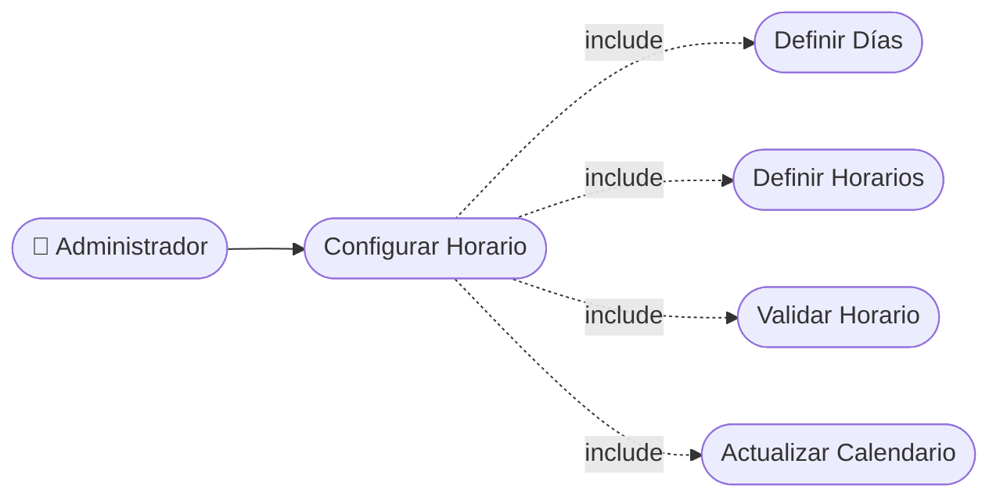

# CU-27 — Configuración de Horario de Atención

> [!WARNING]
> **Estado real (ver HU-027): parcial.**
> El esquema define `horarios_barbero` (horario por barbero, endpoints
> `POST/PUT/DELETE /barberos/{id}/horarios`), pero **no existe una tabla de
> configuración global del negocio** ni endpoints para el horario comercial
> único. Hoy el horario de atención es la unión de los horarios individuales.
> Falta: tabla `configuracion_negocio` (o equivalente) + endpoints de lectura
> y escritura + validación de que los horarios de barbero caigan dentro de él.

[⬅ Volver al README principal](../../../README.md)

---

## Identificación

| Campo | Valor |
|---|---|
| **ID** | CU-27 |
| **Historia de Usuario asociada** | [HU-027](../HUs/HU-027_configuraci%C3%B3n_de_horario_comercial.md) |
| **Módulo** | Configuracion del Negocio |
| **Actores** | Administrador |

---

## Descripción

Permite al administrador definir los días laborales y franjas horarias del negocio para que el calendario solo muestre disponibilidad real.

## Precondiciones

- El administrador debe haber iniciado sesión.
- El módulo de configuración del negocio debe estar disponible.

## Postcondiciones

- El horario de atención queda configurado en el sistema.
- El calendario de reservas refleja únicamente los horarios válidos.

## Secuencia Normal

| # | Acción (actor) | Reacción (sistema) |
|---|---|---|
| 1 | El administrador accede a la configuración del negocio. | El sistema muestra las opciones de horario de atención. |
| 2 | El administrador define los días laborales y franjas horarias. | El sistema valida que la hora de apertura sea anterior al cierre. |
| 3 | El administrador guarda la configuración. | El sistema aplica los horarios al calendario de reservas inmediatamente. |

## Excepciones

| # | Acción (actor) | Reacción (sistema) |
|---|---|---|
| p | La hora de cierre es igual o anterior a la de apertura. | El sistema muestra un error de horario inválido. |
| q | No se selecciona ningún día de atención. | El sistema solicita seleccionar al menos un día de trabajo. |

## Rendimiento

Los cambios de horario deben aplicarse en menos de 2 segundos.

## Frecuencia de uso

Se configura al iniciar el negocio y se ajusta cuando cambian los horarios.

## Diagrama de Caso de Uso

---

[⬅ Volver al README principal](../../../README.md)
