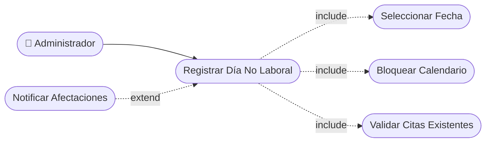

# CU-28 — Registro de Días No Laborales

> [!WARNING]
> **Estado real (ver HU-028): parcial.**
> Existe la tabla `bloqueos_agenda` y los endpoints
> `POST/DELETE /barberos/{id}/bloqueos`, pero la columna `id_barbero` es
> `NOT NULL` y el bloqueo exige `hora_inicio`/`hora_fin`. Es decir: se puede
> bloquear a **un** barbero en un rango horario, no cerrar el negocio completo
> un día festivo. Falta: bloqueos de día completo a nivel de negocio
> (`id_barbero` nullable o tabla `dias_no_laborales`) y su propagación a la
> validación de disponibilidad.

[⬅ Volver al README principal](../../../README.md)

---

## Identificación

| Campo | Valor |
|---|---|
| **ID** | CU-28 |
| **Historia de Usuario asociada** | [HU-028](../HUs/HU-028_registro_de_d%C3%ADas_festivos_o_cierres.md) |
| **Módulo** | Configuracion del Negocio |
| **Actores** | Administrador |

---

## Descripción

Permite al administrador marcar días festivos o cierres especiales para bloquear el calendario y evitar reservas en esas fechas.

## Precondiciones

- El administrador debe haber iniciado sesión.
- La fecha a bloquear debe ser una fecha futura.

## Postcondiciones

- El día queda bloqueado en el calendario del negocio.
- Los clientes no pueden agendar citas en la fecha bloqueada.

## Secuencia Normal

| # | Acción (actor) | Reacción (sistema) |
|---|---|---|
| 1 | El administrador accede al calendario de disponibilidad. | El sistema muestra el calendario general del negocio. |
| 2 | El administrador selecciona la fecha a bloquear. | El sistema muestra las opciones de bloqueo disponibles. |
| 3 | El administrador confirma el bloqueo del día. | El sistema bloquea la fecha y notifica si existen citas afectadas. |

## Excepciones

| # | Acción (actor) | Reacción (sistema) |
|---|---|---|
| p | La fecha seleccionada ya tiene citas agendadas. | El sistema muestra una advertencia con las citas que serían afectadas. |
| q | La fecha seleccionada es anterior a la fecha actual. | El sistema no permite bloquear fechas pasadas. |

## Rendimiento

El bloqueo de fecha debe aplicarse en menos de 2 segundos.

## Frecuencia de uso

Se realiza antes de días festivos, vacaciones o cierres planificados.

## Diagrama de Caso de Uso

---

[⬅ Volver al README principal](../../../README.md)
