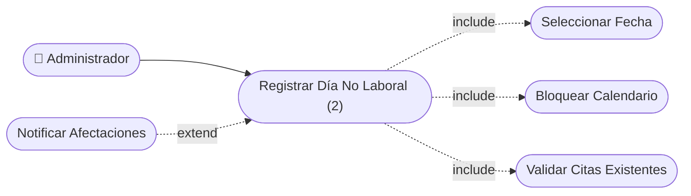

# CU-29 — Reporte de Ingresos

[⬅ Volver al README principal](../../../README.md)

---

## Identificación

| Campo | Valor |
|---|---|
| **ID** | CU-29 |
| **Historia de Usuario asociada** | [HU-029](../HUs/HU-029_reporte_anal%C3%ADtico_de_ingresos.md) |
| **Módulo** | Reportes Administrativos |
| **Actores** | Administrador |

---

## Descripción

Permite al administrador generar reportes de ingresos del negocio filtrables por período (día, semana o mes) para analizar el desempeño económico.

## Precondiciones

- Deben existir citas completadas registradas en el sistema.
- El administrador debe haber iniciado sesión.

## Postcondiciones

- El reporte queda generado con los datos del período seleccionado.
- El administrador puede consultar el total de citas y monto facturado.

## Secuencia Normal

| # | Acción (actor) | Reacción (sistema) |
|---|---|---|
| 1 | El administrador accede al módulo de reportes. | El sistema muestra las opciones de filtro disponibles. |
| 2 | El administrador selecciona el período (día, semana o mes). | El sistema procesa los datos del período seleccionado. |
| 3 | El sistema genera el reporte. | El sistema muestra total de citas, servicios realizados y monto facturado. |

## Excepciones

| # | Acción (actor) | Reacción (sistema) |
|---|---|---|
| p | No hay datos en el período seleccionado. | El sistema muestra: "No se encontraron registros para el período seleccionado". |

## Rendimiento

El reporte debe generarse en menos de 5 segundos.

## Frecuencia de uso

Se realiza periódicamente para el seguimiento del desempeño económico.

## Diagrama de Caso de Uso

---

[⬅ Volver al README principal](../../../README.md)
