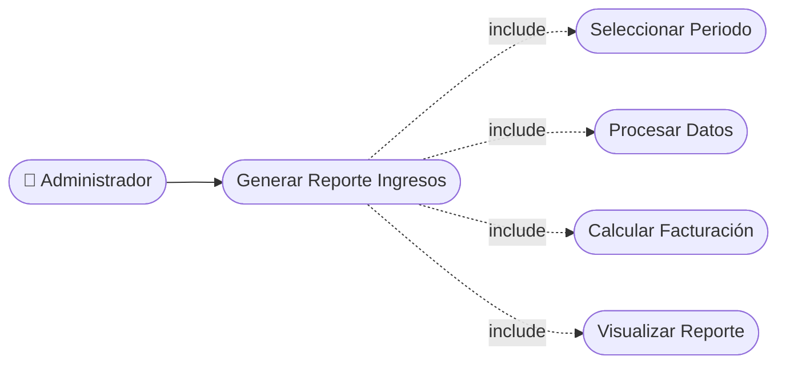

# CU-30 — Ranking de Servicios más Solicitados

[⬅ Volver al README principal](../../../README.md)

---

## Identificación

| Campo | Valor |
|---|---|
| **ID** | CU-30 |
| **Historia de Usuario asociada** | [HU-030](../HUs/HU-030_ranking_de_servicios_m%C3%A1s_solicitados.md) |
| **Módulo** | Reportes Administrativos |
| **Actores** | Administrador |

---

## Descripción

Permite al administrador visualizar un ranking de los servicios con mayor demanda en un período para optimizar la oferta del negocio.

## Precondiciones

- Deben existir citas completadas en el sistema.
- El administrador debe haber iniciado sesión.

## Postcondiciones

- El sistema muestra el ranking de servicios ordenado por cantidad de reservas.
- El administrador puede filtrar el ranking por período.

## Secuencia Normal

| # | Acción (actor) | Reacción (sistema) |
|---|---|---|
| 1 | El administrador accede al módulo de estadísticas. | El sistema muestra el panel de reportes disponibles. |
| 2 | El administrador selecciona el reporte de servicios más solicitados y el período. | El sistema procesa los datos del período. |
| 3 | El sistema genera el ranking. | El administrador visualiza la lista de servicios ordenada por nivel de demanda. |

## Excepciones

| # | Acción (actor) | Reacción (sistema) |
|---|---|---|
| p | No hay datos suficientes en el período seleccionado. | El sistema muestra un aviso informativo de datos insuficientes. |

## Rendimiento

El reporte debe generarse en menos de 4 segundos.

## Frecuencia de uso

Se consulta mensualmente para decisiones sobre la oferta de servicios.

## Diagrama de Caso de Uso

---

[⬅ Volver al README principal](../../../README.md)
