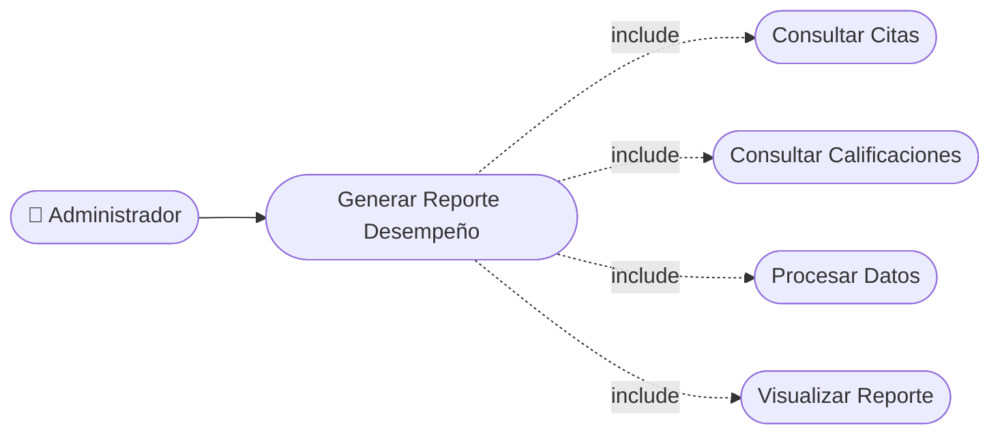

# CU-31 — Reporte de Desempeño por Barbero

[⬅ Volver al README principal](../../../README.md)

---

## Identificación

| Campo | Valor |
|---|---|
| **ID** | CU-31 |
| **Historia de Usuario asociada** | [HU-031](../HUs/HU-031_reporte_de_desempe%C3%B1o_por_barbero.md) |
| **Módulo** | Reportes Administrativos |
| **Actores** | Administrador |

---

## Descripción

Permite al administrador ver el rendimiento individual de cada barbero en términos de citas atendidas y calificación promedio recibida.

## Precondiciones

- Deben existir citas completadas asignadas a barberos.
- El administrador debe haber iniciado sesión.

## Postcondiciones

- El sistema muestra citas atendidas y calificación promedio de cada barbero.
- El administrador puede filtrar el reporte por período.

## Secuencia Normal

| # | Acción (actor) | Reacción (sistema) |
|---|---|---|
| 1 | El administrador accede al módulo de reportes. | El sistema muestra las opciones de reportes disponibles. |
| 2 | El administrador selecciona el reporte de desempeño por barbero y el período. | El sistema procesa las citas completadas y calificaciones de cada barbero. |
| 3 | El sistema genera el reporte. | El administrador visualiza citas atendidas y calificación promedio por barbero. |

## Excepciones

| # | Acción (actor) | Reacción (sistema) |
|---|---|---|
| p | No hay citas completadas en el período. | El sistema muestra: "No se encontraron registros para el período seleccionado". |
| q | No hay barberos registrados en el sistema. | El sistema indica que no existen barberos para generar el reporte. |

## Rendimiento

El reporte debe generarse en menos de 4 segundos.

## Frecuencia de uso

Se consulta periódicamente para evaluar la productividad del equipo.

## Diagrama de Caso de Uso

---

[⬅ Volver al README principal](../../../README.md)
