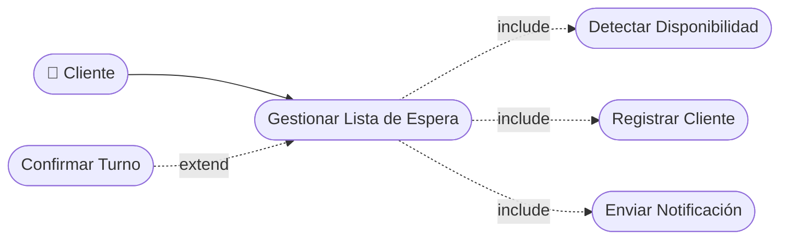

# CU-33 — Gestión de Lista de Espera

> [!CAUTION]
> **Estado real (ver HU-033): no implementada.**
> No existe tabla de lista de espera en la migración
> `dd2ee59368e5_esquema_inicial.py` (las 20 tablas del esquema no incluyen
> ninguna), ni router, ni servicio. En el frontend solo hay menciones en datos
> de maqueta.
> Falta: migración con la tabla `lista_espera`, router y servicio con alta,
> baja y consulta, y el disparador que avise al cliente cuando se libere un
> cupo (se apoyaría en el módulo de notificaciones ya existente).

[⬅ Volver al README principal](../../../README.md)

---

## Identificación

| Campo | Valor |
|---|---|
| **ID** | CU-33 |
| **Historia de Usuario asociada** | [HU-033](../HUs/HU-033_gesti%C3%B3n_de_lista_de_espera.md) |
| **Módulo** | Lista de Espera |
| **Actores** | Cliente, Sistema |

---

## Descripción

Permite al cliente inscribirse en una lista de espera cuando los horarios están ocupados y recibir notificación automática al liberarse un turno.

## Precondiciones

- El cliente debe haber iniciado sesión.
- Todos los horarios disponibles para la fecha deseada deben estar ocupados.

## Postcondiciones

- El cliente queda inscrito en la lista de espera.
- El sistema notifica al cliente cuando se libere un horario disponible.

## Secuencia Normal

| # | Acción (actor) | Reacción (sistema) |
|---|---|---|
| 1 | El cliente intenta reservar y el sistema detecta que no hay horarios disponibles. | El sistema muestra el mensaje de no disponibilidad y ofrece unirse a la lista de espera. |
| 2 | El cliente selecciona unirse a la lista de espera. | El sistema registra al cliente en la lista para la fecha deseada. |
| 3 | Se libera un horario por cancelación. | El sistema notifica automáticamente al primer cliente de la lista de espera. |
| 4 | El cliente recibe la notificación y confirma o rechaza el turno. | Si confirma, el sistema registra la cita. Si no confirma en 30 min, ofrece el turno al siguiente. |

## Excepciones

| # | Acción (actor) | Reacción (sistema) |
|---|---|---|
| p | El cliente ya está en la lista de espera para esa fecha. | El sistema muestra: "Ya estás inscrito en la lista de espera para esta fecha". |
| q | No se libera ningún horario antes de la fecha deseada. | El sistema notifica al cliente que no hubo disponibilidad y cierra la lista de espera. |

## Rendimiento

La notificación al cliente de la lista de espera debe enviarse en menos de 10 segundos tras la cancelación.

## Frecuencia de uso

Se activa cada vez que un cliente intenta reservar y no hay horarios disponibles.

## Diagrama de Caso de Uso

---

[⬅ Volver al README principal](../../../README.md)
